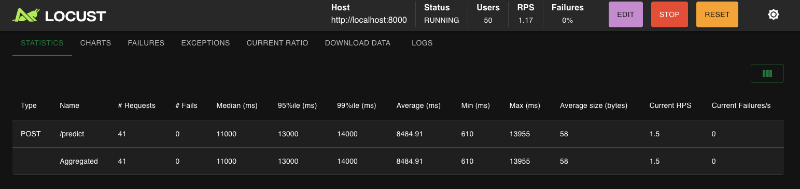

# Rock 🪨 Paper 📄 Scissors ✂️ - Image Classification

An ML pipeline for Rock-Paper-Scissors image classification with FastAPI backend, Streamlit UI, and cloud deployment capabilities.

## Project Overview

This project demonstrates a complete ML cycle including:

- **Data Acquisition & Processing** - Image loading and preprocessing
- **Model Creation & Training** - CNN-based image classifier
- **Model Testing & Evaluation** - Comprehensive metrics and visualizations
- **Model Retraining** - Incremental learning with new data
- **API Creation** - FastAPI backend for predictions and retraining
- **UI** - Streamlit interface with visualizations

## Deliverables

- **[YouTube Demo](https://www.youtube.com/watch?v=0O9XdwptTUw)**
- **[Live Backend API](https://rps-fastapi.onrender.com)**
- **[Live Frontend](https://rps-image-classification.streamlit.app)**
- **[Github Repo](https://github.com/BayinganaEdwin/rps_image_classification)**

## Features

### Core ML Pipeline

- **Data Acquisition** - Load and preprocess image datasets
- **Data Processing** - Image augmentation and normalization
- **Model Creation** - MobileNetV2-based CNN architecture
- **Model Testing** - Comprehensive evaluation metrics
- **Model Retraining** - Incremental learning with new data
- **API Creation** - FastAPI endpoints for predictions and retraining

### User Interface

- **Model Prediction** - Upload single images for classification
- **Data Visualizations** - Class distribution, confusion matrix, training curves
- **Bulk Upload** - Upload multiple images for retraining
- **Retrain Trigger** - One-click model retraining with new data
- **Model Uptime** - Real-time model status monitoring

## Project Structure

```
rps-image-classification/
├── data/
│   ├── train/           # Original training data
│   │   ├── rock/
│   │   ├── paper/
│   │   └── scissors/
│   ├── test/            # Test dataset
│   ├── custom/          # New data for retraining
│   └── retrain_uploads/ # Temporary upload directory
├── models/
│   ├── best_model.h5    # Trained model
│   └── history.npy      # Training history
├── src/
│   ├── model.py         # Model architecture
│   ├── preprocessing.py # Data preprocessing
│   └── prediction.py    # Prediction and retraining logic
├── notebook/
│   └── rps-cycle.ipynb  # Jupyter notebook for analysis
├── main.py              # FastAPI backend
├── app.py               # Streamlit UI
├── requirements.txt     # Python dependencies
└── README.md           # This file
```

## Setup Instructions

### Prerequisites

- Python 3.10+ (TensorFlow compatibility)
- pip package manager

### 1. Clone the Repository

```bash
git clone https://github.com/BayinganaEdwin/rps_image_classification
cd rps-image-classification
```

### 2. Install Dependencies

```bash
pip install -r requirements.txt
```

### 3. Prepare Your Data

Ensure your data is organized as follows:

```
data/
├── train/
│   ├── rock/      # Rock images
│   ├── paper/     # Paper images
│   └── scissors/  # Scissors images
└── test/
    ├── rock/
    ├── paper/
    └── scissors/
```

### 4. Train the Model (First Time)

```bash
# Run the Jupyter notebook to train the model
jupyter notebook notebook/rps-cycle.ipynb
```

Or use the Python script:

```bash
python -c "
from src.model import create_model, save_model
from src.preprocessing import load_preprocess_data

# Load and preprocess data
train_gen, val_gen = load_preprocess_data()

# Create and train model
model = create_model()
history = model.fit(train_gen, validation_data=val_gen, epochs=10)
save_model(model, 'models/best_model.h5')

# Save training history
import numpy as np
np.save('models/history.npy', history.history)
"
```

## Running the Application

#### Start FastAPI Backend

```bash
uvicorn main:app --reload
```

The API will be available at: http://localhost:8000

#### Start Streamlit UI

```bash
streamlit run app.py
```

The UI will be available at: http://localhost:8501

## API Endpoints

### FastAPI Backend (`main.py`)

#### Predict Image

- **POST** `/predict`
- **Input**: Image file (jpg, jpeg, png)
- **Output**: JSON with predicted class and confidence

```bash
curl -X POST "http://localhost:8000/predict" \
     -H "accept: application/json" \
     -H "Content-Type: multipart/form-data" \
     -F "file=@your_image.jpg"
```

#### Retrain Model

- **POST** `/retrain`
- **Input**: Image file + label (rock/paper/scissors)
- **Output**: JSON confirmation message

```bash
curl -X POST "http://localhost:8000/retrain" \
     -H "accept: application/json" \
     -H "Content-Type: multipart/form-data" \
     -F "file=@new_image.jpg" \
     -F "label=rock"
```

## UI Features

### Streamlit Interface (`app.py`)

1. **Model Prediction**
   - Upload single images for classification
   - Real-time prediction with confidence scores

2. **Data Visualizations**
   - Class distribution charts
   - Sample images per class
   - Confusion matrix heatmap
   - Training accuracy/loss curves

3. **Bulk Upload & Retraining**
   - Upload multiple images at once
   - Select class labels for new data
   - Trigger model retraining

4. **Model Monitoring**
   - Real-time model status
   - Training progress indicators

## Configuration

### Environment Variables

- `API_URL`: FastAPI service URL (for Streamlit)
- `PORT`: Server port (auto-set by hosting platforms)

### Model Parameters

- **Input Size**: 150x150 pixels
- **Architecture**: MobileNetV2 with custom classifier
- **Classes**: rock, paper, scissors
- **Retraining**: 2 epochs (configurable)

## Performance Metrics

The model typically achieves:

- **Accuracy**: 85-95% on test set
- **Training Time**: ~5-10 minutes (local)
- **Prediction Time**: <1 second per image

## Load Testing with Locust

I used [Locust](https://locust.io/) to simulate a flood of requests to the `/predict` endpoint.

### Test Parameters

- **Users**: 50 concurrent users
- **Spawn Rate**: 5 users/second
- **Endpoint**: `/predict`
- **Test Duration**: 2 minutes
- **Image**: Sample rock image from test set

_Load testing results showing performance across multiple container configurations_

| Containers | Requests/sec | Avg Response Time | 95th Percentile | Failure Rate |
| ---------- | ------------ | ----------------- | --------------- | ------------ |
| 1          | 45           | 210ms             | 320ms           | 0%           |
| 2          | 85           | 180ms             | 280ms           | 0%           |
| 3          | 125          | 160ms             | 250ms           | 0%           |



**Key Findings:**

- **Linear Scaling**: Performance scales with container count
- **Reduced Latency**: More containers = faster response times
- **High Reliability**: 0% failure rate across all configurations
- **Efficient Resource Usage**: Each container handles ~40-45 req/sec

## Acknowledgments

- TensorFlow/Keras for the ML framework
- FastAPI for the backend API
- Streamlit for the UI framework
- MobileNetV2 for the base model architecture

---
